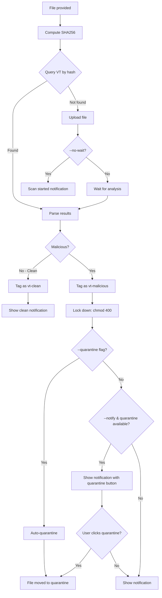

## Overview

vt-check is a comprehensive bash wrapper around the official [VirusTotal CLI](https://github.com/VirusTotal/vt-cli) that provides:
- Hash-based file lookups and scanning
- Desktop notifications with action buttons
- Automatic file tagging (KDE)
- Automatic permission lockdown for malicious files
- One-click quarantine with optional noexec protection

## Flow Diagram



## Step-by-Step

### 1. Hash Computation

The file's SHA256 hash is computed locally using `sha256sum`:

```bash
sha256sum "$file" | cut -d' ' -f1
```

This hash uniquely identifies the file content and is used for lookups.

### 2. Database Lookup

Using the hash, we query VirusTotal's database:

```bash
vt file "$hash" --format json
```

If the file has been scanned before (by anyone), we get:
- Last analysis stats (malicious, suspicious, harmless, undetected counts)
- Last analysis date
- File type tag
- And more metadata

### 3. Upload (if needed)

If the hash isn't found, the file is uploaded for scanning:

```bash
vt scan file "$file" --format json [--wait]
```

With `--wait`, the CLI polls until analysis completes (can take 1-5 minutes).

### 4. Result Processing

The JSON response is parsed with `jq` to extract:

```bash
malicious=$(echo "$result" | jq -r '.[0].last_analysis_stats.malicious // 0')
suspicious=$(echo "$result" | jq -r '.[0].last_analysis_stats.suspicious // 0')
harmless=$(echo "$result" | jq -r '.[0].last_analysis_stats.harmless // 0')
undetected=$(echo "$result" | jq -r '.[0].last_analysis_stats.undetected // 0')
```

The status is formatted as:
- **Clean** — no engines detected anything (`malicious + suspicious = 0`)
- **Malicious (N/total)** — N engines flagged it as malicious or suspicious

### 5. File Tagging & Lockdown

Based on the scan results, files are automatically processed:

#### Clean Files
```bash
# Tag using xattr (visible in KDE Dolphin)
setfattr -n user.xdg.tags -v "vt-clean" "$file"
# Restore normal permissions if previously restricted
chmod u+w "$file"
```

#### Malicious Files
```bash
# Tag as malicious
setfattr -n user.xdg.tags -v "vt-malicious" "$file"
# Remove execute permissions for all users
chmod a-x "$file"
# Make read-only (owner can still delete)
chmod a-w "$file"
chmod u+r "$file"
# Store original permissions and metadata in xattr
setfattr -n user.vt.original_perms -v "$perms" "$file"
setfattr -n user.vt.scan_time -v "$timestamp" "$file"
setfattr -n user.vt.status -v "malicious" "$file"
```

**Result:** Malicious files become `chmod 400` (read-only, no execute) and are clearly tagged.

### 6. Quarantine System

#### Automatic Quarantine
With `--quarantine` flag, malicious files are automatically moved:

```bash
vt-check --quarantine suspicious.exe
```

Flow:
1. File detected as malicious
2. Locked down with `chmod 400`
3. Automatically moved to `~/.local/share/virustotal-quarantine/`
4. Tagged as `vt-quarantined`
5. Original path stored in xattr for potential restoration

#### Interactive Quarantine
With `--notify` flag, users get a notification with action button:

- **Quarantine button only appears if:**
  - File is malicious
  - Quarantine directory exists and is writable
  - Notification backend is `notify-send` or `dunstify` (kdialog and zenity don't support action buttons)

- **User clicks "Quarantine File":**
  1. File moved to quarantine
  2. Permissions set to `chmod 400`
  3. Tagged and metadata stored
  4. Success/failure notification shown

#### Quarantine Location
```bash
~/.local/share/virustotal-quarantine/
```

With optional noexec mount:
```bash
# System mount with kernel-level noexec
sudo ./setup-system-mount.sh
```

This creates a tmpfs mount with:
- `noexec` - Cannot execute files (kernel enforced)
- `nosuid` - Cannot use suid bits
- `nodev` - Cannot use device files  
- `mode=0700` - Only owner can access
- `uid/gid` - Owned by your user

Files in quarantine **cannot execute** even if permissions are changed.

### 7. Notifications

Desktop notifications are sent via auto-detected backend:

| Backend | Replace | Action Buttons | Urgency | Icons |
|---------|---------|----------------|---------|-------|
| notify-send (libnotify) | ✓ | ✓ | ✓ | ✓ |
| dunstify (Dunst) | ✓ | ✓ | ✓ | ✓ |
| kdialog (KDE) | ✗ | ✗ | ✗ | ✓ |
| zenity (GTK) | ✗ | ✗ | ✗ | ✗ |

**Features:**
- Notifications are replaced (not stacked) as progress updates occur (notify-send, dunstify)
- **Action buttons** (notify-send, dunstify only):
  - "View Results in Browser" - Opens VirusTotal report
  - "Quarantine File" - Moves file to quarantine (malicious files only)
- Critical urgency for malicious files (notify-send, dunstify)
- **kdialog and zenity:** Basic notifications only, no action buttons

## Command Line Options

```bash
vt-check [OPTIONS] <file>
```

### Options

| Option | Description |
|--------|-------------|
| `--notify` | Show desktop notifications for progress and results |
| `--no-wait` | Upload file but don't wait for analysis (faster, no results) |
| `--quarantine` | Automatically quarantine if malicious (no prompt) |
| `-h, --help` | Show help message |

### Usage Combinations

```bash
# Basic scan (terminal output only)
vt-check file.exe

# Scan with notifications
vt-check --notify file.exe

# Scan and auto-quarantine if malicious
vt-check --quarantine --notify file.exe

# Quick upload (don't wait for results)
vt-check --no-wait --notify file.exe

# Script mode: auto-quarantine without notifications
vt-check --quarantine file.exe
```

## Why a Shell Script?

The original Python implementation required:
- Python 3.8+
- vt-py library
- API key file management
- Virtual environment (recommended)

This shell version requires:
- bash
- vt CLI (single binary)
- jq

The vt CLI handles:
- API authentication (stored in `~/.vt.toml`)
- Rate limiting
- File upload chunking
- Polling for results

We just orchestrate the workflow and add notifications.

## Security Considerations

> [!WARNING]
> Files uploaded to VirusTotal are shared with security researchers and antivirus companies.
> **Do not upload sensitive, confidential, or personally identifiable files.**

- **API key is stored locally** in `~/.vt.toml` by the vt CLI
- **No data leaves your machine** except to VirusTotal's API
- For sensitive files, use hash-only lookup services instead
