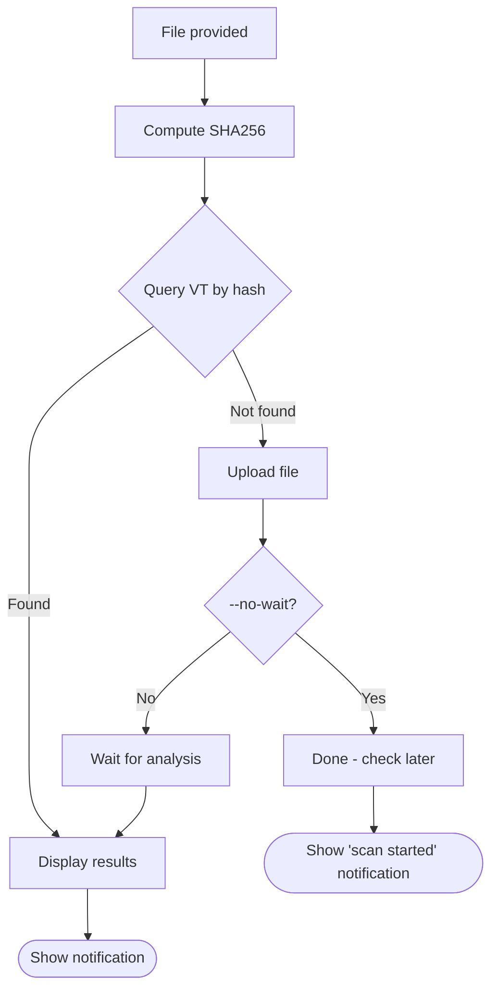

# How It Works

## Overview

vt-check is a bash wrapper around the official [VirusTotal CLI](https://github.com/VirusTotal/vt-cli) that provides a streamlined workflow for checking files and desktop notifications.

## Flow Diagram



## Step-by-Step

### 1. Hash Computation

The file's SHA256 hash is computed locally using `sha256sum`:

```bash
sha256sum "$file" | cut -d' ' -f1
```

This hash uniquely identifies the file content and is used for lookups.

### 2. Database Lookup

Using the hash, we query VirusTotal's database:

```bash
vt file "$hash" --format json
```

If the file has been scanned before (by anyone), we get:
- Last analysis stats (malicious, suspicious, harmless, undetected counts)
- Last analysis date
- File type tag
- And more metadata

### 3. Upload (if needed)

If the hash isn't found, the file is uploaded for scanning:

```bash
vt scan file "$file" --format json [--wait]
```

With `--wait`, the CLI polls until analysis completes (can take 1-5 minutes).

### 4. Result Processing

The JSON response is parsed with `jq` to extract:

```bash
malicious=$(echo "$result" | jq -r '.[0].last_analysis_stats.malicious // 0')
suspicious=$(echo "$result" | jq -r '.[0].last_analysis_stats.suspicious // 0')
```

The status is formatted as:
- **Clean** — no engines detected anything
- **Malicious (N/total)** — N engines flagged it

### 5. Notifications

Desktop notifications are sent via detected backend:

| Backend | Features |
|---------|----------|
| notify-send | Replace, actions, urgency, icons |
| dunstify | Replace, actions, urgency, icons |
| kdialog | Basic popup, timeout |
| zenity | Basic notification |

Notifications are replaced (not stacked) as progress updates occur.

## Why a Shell Script?

The original Python implementation required:
- Python 3.8+
- vt-py library
- API key file management
- Virtual environment (recommended)

This shell version requires:
- bash
- vt CLI (single binary)
- jq

The vt CLI handles:
- API authentication (stored in `~/.vt.toml`)
- Rate limiting
- File upload chunking
- Polling for results

We just orchestrate the workflow and add notifications.

## Security Considerations

- **Files are uploaded to VirusTotal** — they become available to premium users
- **Don't scan sensitive/private files** — use hash-only lookup services for those
- **API key is stored locally** — in `~/.vt.toml` by the vt CLI
- **No data leaves your machine** except to VirusTotal's API
